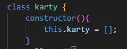
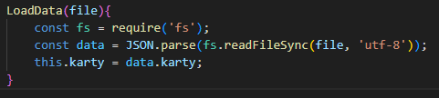
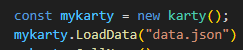
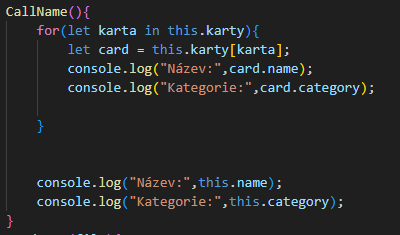
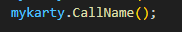

### Programování

Zde jsem si udělal konstruktor který musím v js a nastavil jsem si že bude pole do kterého dáme jednotlivé karty.

Zde je funkce která načte json soubor pomocí fs.readfilesync a rozparsuje ho.

Zde tu je instance třídy a zavolání funkce na rozparsování jako input dáme lokaci/nazev souboru.

Protože je v dvourozměrném poli tak si ho projedu a za každou kartu vypíšu její název a kategorii. Metodu zavolam jednoduše viz screenshot dole.

